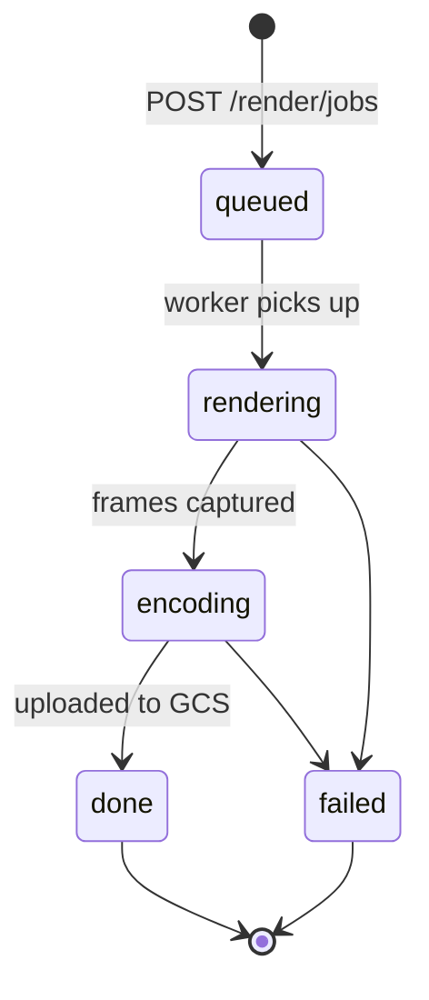

# Cloud Render Specification

Server-side MP4 rendering for Crystal Showcase and legacy cube_focus entrance videos.

## API

Base path: `/render/jobs` on `apps/api`.

### Create job

```
POST /render/jobs
Content-Type: application/json
X-API-Key: ...
X-Workspace-Id: default
```

Request body (`CreateRenderJobRequest` from `@mbox/shared`):

```json
{
  "kind": "crystal_showcase",
  "workspaceId": "default",
  "processedImageRefs": [{ "id": "1", "vaultPath": "workspaces/..." }],
  "settings": {
    "kind": "crystal_showcase",
    "catalogOptions": { "shapeId": "cube", "...": "..." },
    "imageCount": 3,
    "fallPhysicsEnabled": true,
    "backdropMediaPath": "default/rose.mp4"
  },
  "outputProfile": {
    "width": 1080,
    "height": 1080,
    "fps": 60,
    "codec": "h264"
  }
}
```

cube_focus example:

```json
{
  "kind": "cube_focus_entrance",
  "processedImageRefs": [{ "id": "1" }],
  "settings": {
    "kind": "cube_focus_entrance",
    "presentationSettings": {},
    "imageIds": ["1", "2", "3", "4", "5", "6"],
    "bgmRef": "/bgm/bridal-chorus.mp3"
  },
  "outputProfile": { "width": 1024, "height": 1024, "fps": 30, "codec": "h264" }
}
```

Response `201`:

```json
{
  "job": {
    "id": "render-abc123",
    "kind": "crystal_showcase",
    "status": "queued",
    "workspaceId": "default",
    "createdAt": 1719000000000,
    "updatedAt": 1719000000000
  }
}
```

### Get job status

```
GET /render/jobs/:jobId
```

Response:

```json
{
  "job": {
    "id": "render-abc123",
    "status": "done",
    "outputUrl": "https://...",
    "outputPath": "renders/default/render-abc123.mp4",
    "progress": 100
  }
}
```

## Job state machine



| Status | Meaning |
|--------|---------|
| `queued` | Accepted, waiting for worker |
| `rendering` | Headless Chromium + WebGL capture |
| `encoding` | ffmpeg normalize (if needed) |
| `done` | MP4 in GCS, `outputUrl` set |
| `failed` | See `error` field |

## Storage layout

| Object | Path |
|--------|------|
| Job metadata | `data/render-jobs/{jobId}.json` (local) or API volume |
| Output MP4 | `renders/{workspaceId}/{jobId}.mp4` in `GCS_VAULT_BUCKET` |
| Temp frames | Worker local disk only |

Signed read URL via `createVaultReadUrl()` (7-day default).

## Worker architecture

Recommended: **Headless Chromium + WebGL** (same as Playwright E2E).

| Pipeline | Worker URL | Init flags |
|----------|------------|------------|
| Crystal | `{WEB_BASE}/showcase.html?renderJob=1` | `window.__MBOX_RENDER_JOB__`, `__MBOX_E2E_EXPORT__` |
| cube_focus | `{WEB_BASE}/cube-render.html` | `window.__MBOX_RENDER_JOB__`, `__MBOX_E2E_EXPORT__` |

Chromium args:

```
--use-gl=angle
--ignore-gpu-blocklist
--enable-webgl
--disable-background-timer-throttling
--disable-renderer-backgrounding
```

### Worker scripts

| Script | Role |
|--------|------|
| `scripts/render-worker.mjs` | Poll `/render/jobs?status=queued`, process batch |
| `scripts/render-worker-process-job.mjs` | Single job: Playwright → GCS upload |
| `scripts/verify-render-job-crystal.mjs` | E2E: create job → assert done |
| `scripts/verify-render-job-cube.mjs` | E2E: cube_focus job |

### Environment

| Variable | Purpose |
|----------|---------|
| `RENDER_WORKER_ENABLED` | API spawns inline worker on job create (dev) |
| `MBOX_WEB_BASE_URL` | Worker navigates here (default `http://localhost:5173`) |
| `GCS_VAULT_BUCKET` | Output upload |
| `RENDER_JOB_DATA_DIR` | Job JSON store (default `data/render-jobs`) |

## ffmpeg parameters

When browser produces WebM or worker captures PNG sequence:

| Pipeline | Codec | Bitrate |
|----------|-------|---------|
| Crystal 1080² | libx264 | ~12 Mbps (`resolveShowcaseEncodeBitrate`) |
| cube_focus 1024² | libx264 | ~10 Mbps (`resolveVideoBitsPerSecond`) |
| Audio (cube BGM) | aac | 192k |

Crystal export is usually H.264 from `MediaRecorder`; worker re-muxes only if needed.

## Docker

- API: existing `apps/api/Dockerfile`
- Render worker: `apps/render-worker/Dockerfile` — Node 22 + Chromium + ffmpeg

`cloudbuild.yaml` can add a render-worker image build step (optional for pilot).

## Client integration

```typescript
import { resolveRenderBackend } from "../shared/lib/renderBackend";
import { submitAndAwaitRenderJob } from "../shared/lib/cloudRenderClient";

if (resolveRenderBackend() === "cloud") {
  const { outputUrl } = await submitAndAwaitRenderJob(request);
  // trigger download from outputUrl
} else {
  await exportShowcaseMp4(...);
}
```

Set `VITE_RENDER_BACKEND=cloud` in production when workers are live.
