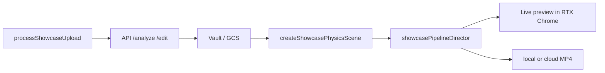

# Crystal Architecture

Crystal (크리스탈 쇼케이스) is the **primary Mbox product**. It renders photos inside jewel/crystal shapes using Babylon.js and exports square MP4 for booth displays.

## Product boundary

| Layer | Path | Role |
|-------|------|------|
| Entry (default) | `apps/web/showcase.html` → `ShowcaseDashboard` | Upload, catalog, preview, export |
| Feature root | `apps/web/src/features/showcase/` | UI, Babylon scene, pipeline, export |
| Shared contracts | `packages/shared` | `hologramDisplaySpec`, `showcaseCommercial*` |
| Image prep API | `apps/api` | `/analyze`, `/edit`, vault — no video encode |
| Cloud render | `apps/api` `/render/jobs` + worker | MP4 when `VITE_RENDER_BACKEND=cloud` |

Crystal is **not** a separate package or microservice. It ships inside `@mbox/web` as a Vite MPA entry.

## GPU preview (RTX Chrome companion)

Cursor / VS Code embedded browser cannot run reliable WebGL. Production preview uses a **two-tab companion**:

| Tab | URL flags | Role |
|-----|-----------|------|
| **Shell** | default `showcase.html` | Upload, catalog, export UI — no in-tab WebGL when IDE shell |
| **Target** | `?localOnly=1&fullGpu=1&companionTarget=1&noPhysics=1` | RTX Chrome — Babylon render |

State sync: `BroadcastChannel` (`mbox-showcase-companion`) — images, catalog, playing, export status.

Open Target manually or via `scripts/open-showcase-gpu.mjs` / Vite `POST /__mbox/open-gpu-browser`.

## Runtime flow



## Module map

### UI & catalog

- `ShowcaseDashboard.tsx` — main screen, companion hooks, E2E audit registration
- `ShowcaseCatalogPanel.tsx` — shape, colors, backdrop controls
- `showcaseCatalogOptions.ts` — `ShowcaseCatalogOptions`, URL query sync
- `useShowcaseChromeCompanion.ts` — shell/target BroadcastChannel

### Shape catalog (PhotoCrystal)

- `babylon/photoCrystalShapeCatalog.ts` — shapes: `cube`, `tall_rect`, `hex_prism`, `heart`, `sphere`, `gem_prism`
- `babylon/jewelCubeFactory.ts` — jewel rig spawn + dispose
- `babylon/jewelPhotoCore.ts` — inner photo meshes per shape
- `babylon/shaders/jewelCrystalShellShader.ts` — glass shell material
- `babylon/shaders/jewelInnerPhotoShader.ts` — inner photo layers

### Pipeline stages (active)

Order in `pipeline/pipelineOrder.ts` — **rotation-only, no Havok fall**:

| Stage | File | Behavior |
|-------|------|----------|
| reveal | `stages/revealStage.ts` | Jewel spawn, holo ramp, async spawn token guard |
| rotate | `stages/rotateStage.ts` | Y-axis spin + multi-photo morph |
| pull | `stages/pullAscendStages.ts` | Zoom + hero framing |
| ascend | `stages/pullAscendStages.ts` | Return to float pose |

Director: `pipeline/showcasePipelineDirector.ts` — `reset()` bumps `jewelSpawnGeneration` to cancel stale spawns.

### GPU profile defaults (`showcaseGpuProfile.ts`)

- `singleInnerPhoto: true` — one inner photo volume (no fg/bg twin stacks)
- `crystalShell: true` — glossy outer shell
- `depthSplitForeground: false` — no duplicate front geometry
- `noPhysics=1` — kinematic stub, no Havok sim in preview

### Export

- `showcaseExportCapture.ts` — `exportShowcaseMp4()`
- `showcaseExportCompositeStream.ts` — backdrop video + WebGL → 2D canvas stream
- `showcaseExportVerification.ts` — WYSIWYG luma gate

## Verification pyramid (stability-first)

```bash
# Default — static + math + live E2E (dev server on :5173 required)
npm run verify:showcase-pipeline

# Fast static/math only (no browser)
npm run verify:showcase-pipeline:fast
```

| Tier | Scripts | What |
|------|---------|------|
| 0 Static | `verify:chrome-companion`, `verify:single-inner-photo`, … | Source contracts, debounce, gpu lock |
| 1 Math | `verify:showcase-rotate-ease`, `verify:inner-cube-seams`, `verify:showcase-shapes` | Geometry, easing |
| 2 Live E2E | `verify:showcase-upload-e2e`, `verify:showcase-shape-cycle` | **Included by default** |

Escape hatch: `MBOX_SKIP_E2E=1` or `verify:showcase-pipeline:fast`.

## Local URLs

| URL | Purpose |
|-----|---------|
| `http://localhost:5173/showcase.html` | Crystal shell (UI) |
| `http://localhost:5173/showcase.html?localOnly=1&fullGpu=1&companionTarget=1&noPhysics=1` | RTX Chrome GPU target |

See [render-pipelines.md](./render-pipelines.md) for export specs and [cloud-render-spec.md](./cloud-render-spec.md) for server-side MP4 jobs.
